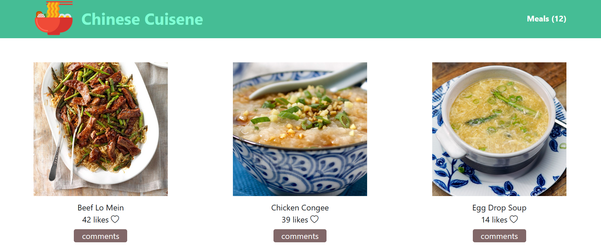
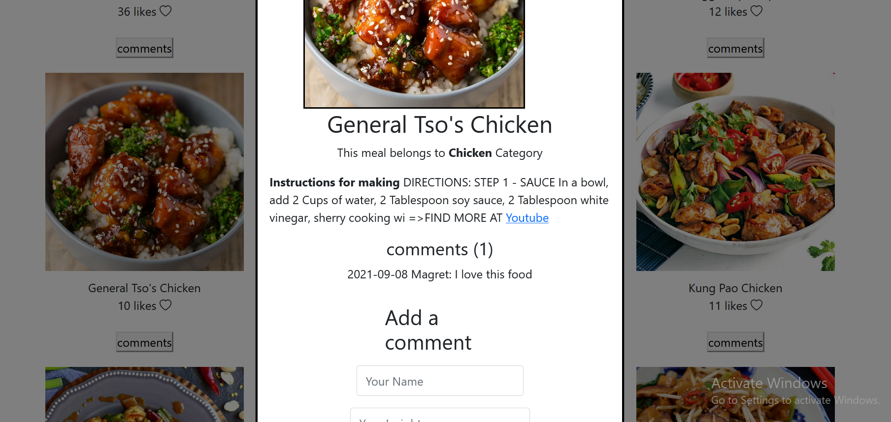

# javascriptcapstone
> This project is built based on external APIs. One  [Meals DB API](https://www.themealdb.com/api.php) storing information abot meals and another [Involvement API](https://www.notion.so/microverse/Involvement-API-869e60b5ad104603aa6db59e08150270) to help with page interactions

## Built With

This project is build with:

- , , 
- 
- [Bootstrap5](https://getbootstrap.com/docs/5.0/)

## Getting Started

To get the content of this project locally you need to run this command in your terminal:

- `git clone git@github.com:Kalunge/javascriptcapstone.git`
- `cd javascriptcapstone`
- `run npm Install` This command will download all the dependancies of the project
- Use `npm start` to run the app in live server

## Test

- To test run the following command

  > `npm test`

## Authors

👤 **Blakbox23**

- GitHub: [@Blakbox23](https://github.com/blakbox23)
- Twitter: [@blakbox23](https://twitter.com/blakbox23)
- LinkedIn: [Peter Mbuthia](https://www.linkedin.com/in/peter-mbuthia)

👤 **Kalunge**

- GitHub: [@kalunge](https://github.com/kalunge)
- Twitter: [@kalunge](https://twitter.com/titus_muthomi)
- LinkedIn: [kalunge](https://linkedin.com/in/titus_muthomi)

## :handshake: Contributing

Feel free to check the [issues page](https://github.com/Kalunge/javascriptcapstone/issues)

## Show your support

Give a :star: if you like this project!

## Acknowledgments

- Thanks to everyone who will get time to check this code especially to code reviewers.

## 📝 License

This project is [MIT](https://github.com/microverseinc/readme-template/blob/master/MIT.md) licensed.
